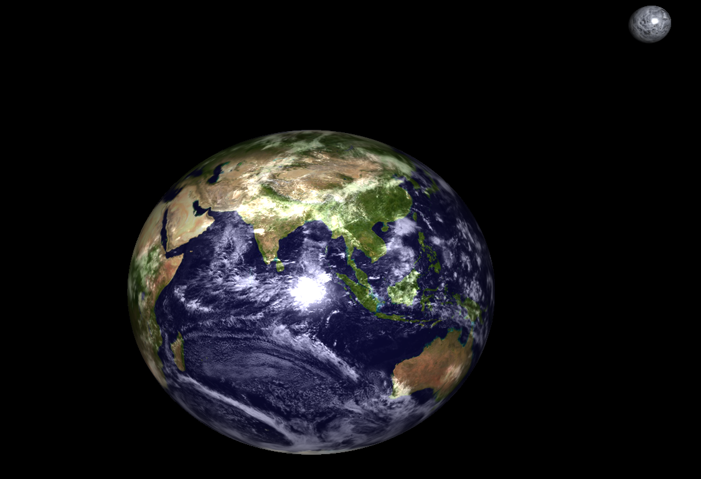
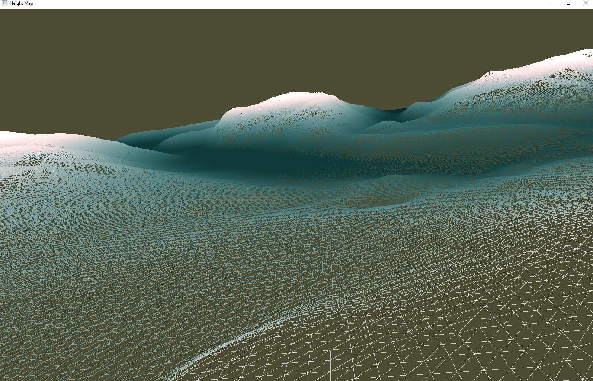
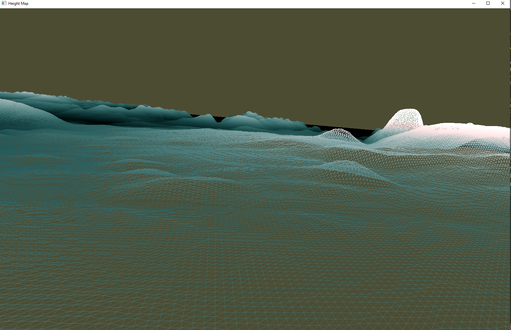

# OpenGL Height Map from png image

<html>
<body>
<h1>Usage: </h1>
<h4>Just put an image in textures folder and type the name (with the extension) in the console prompt and the program will generate a height map</h4>

<ul>
  <li>WASD camera moviment</li>
  <li>Compiled via CMAKE</li>
  <li>Color according not only with the height but sloping terrain has slightly redish identification</li>
  <li>Uses GLSL shaders</li>
  <li>Press LEFT CTRL to change polygon mode beetween wireframe or fill</li>
    <li>Press LEFT SHIFT to move faster</li>
    <li>**Has directional lighting but is not yet implemented for moviment </li>
</ul>

<h4>If you can't compile for some reason, please delete "out" folder and try running CMAKE again.</h4>

  
   
    
 </body>
</html>